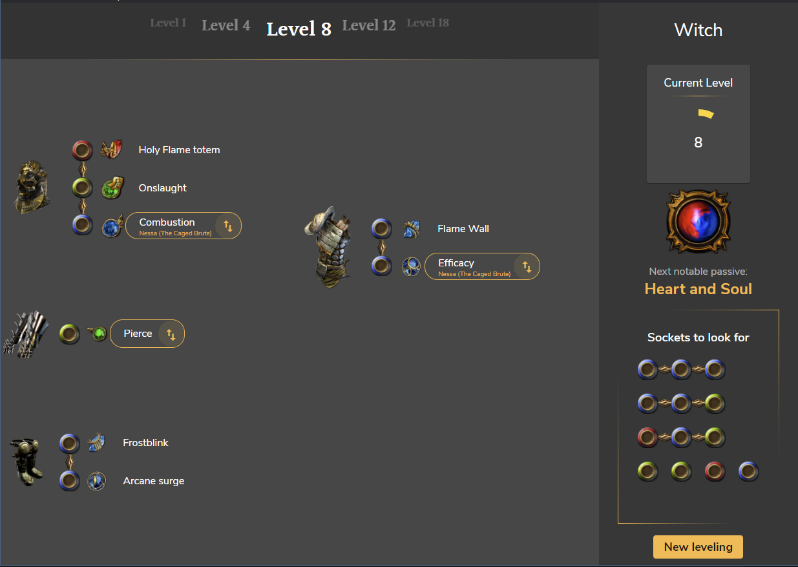
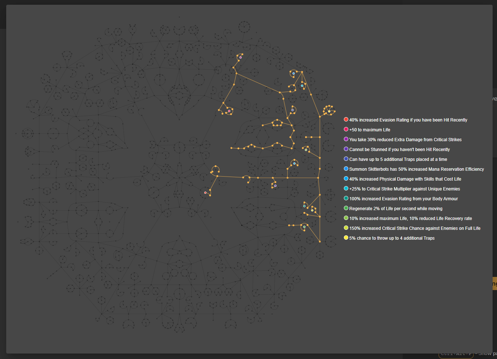

# PoE : Second Screen

This project was generated with [Angular CLI](https://github.com/angular/angular-cli) version 11.2.7.

It uses Electron as a way to make it desktop ready.

Passive tree version: PoE version **3.16** (Scourge)

# 🔍 Overview



How does it work :

- Click the "New leveling" button
- Enter your character name. It **MUST MATCH** your PoE character name.
- Select your class from the dropdown.
- Click "Next"
- Put your client.txt location. It's a one time thing, it is used to track your in-game evolution. This file is located in the `logs` folder in the PoE installation directory. For example, mine is at : `C:/Program Files (x86)/Steam/steamapps/common/Path of Exile/logs/client.txt` so this is what I would put in this field (don't forget the `client.txt` part !)
- Click "Next". Two choices here:
  - Import your file with "Import leveling file"
  - Paste your POB pastebin link and click "Import PoB" (⚠️ See PoB Format section !! ⚠️)
- Put the application window on your second screen
- Play _PoE_
- When you reach the next level threshold, the gems and link will change, **highlighting the new additions, and where they come from**. Use it to make the appropriate changes in your character !
- If you use the PoB, `Ctrl + Alt + P` will show the final passive tree, with masteries. If you don't have the PoB, you should have a step-by-step notable passives to pick up.
- Enjoy your leveling !
- (Optional) Use the _"Socket to look for"_ section if you want to have some notes about which item you should pick

# ⚠️ Version 1.2.0

It's finally here !

PoE Second Screen v1.20 introduces **POB support** along with a few changes. Check the PoB Format section to see how this work

# 📝 Leveling file

Here's how the JSON should be organized, if you chose the leveling file way:

```typescript
    {
        // This contains the gems and link section
        "gearing": [
            // This next section is repeatable
            // (CAREFUL: you must have a section with level: 1 to start with !)
            {
                // Level requirement for this section
                level: 1,
                // Gear link
                gear: [
                    // Sockets (can be repeated with "helmet", "body_armor",
                    // "gloves", "boots" & "two_handed". All 5 sections must
                    // be completed, even if empty)
                    // This next section is repeatable
                    {
                        // Item holding the links
                        "type": "helmet",
                        // Items links (B = Blue, G = Green, R = Red)
                        // If wrote together, sockets will form a link
                        // (["BB", "GB", "R"] will form a gear piece like that "B-B G-B R")
                        "sockets": ["BG", "B"],
                        // Corresponding gems, be careful of typos !
                        "gems": ["Frost bomb", "Onslaught", "Orb of Storms"]
                    },
                    // Empty gear example
                    {
                        "type": "body_armor",
                        "sockets": [],
                        "gems": []
                    }
                    ...
                ]
            },
            ...
        ],
        // This contains the notable passives list
        "notables": [
            // This next section is repeatable
            {
                // Number of passive points required to link this notable
                // Careful here: it's INCREMENTAL (see examples)
                passivesRequired: 7,
                // Notable name, be careful of typos !
                name: "Arcanist's Dominion",
            }
            ...
        ],
        // This is the section that reflects the links to look for during leveling
        "itemsToLookFor": [
            // This next section is repeatable
            {
                // Minimal level to display the item
                "level": 1,
                // Optional : Max level after which the item shouldn't be displayed.
                // If not set, item will be displayed forever after "level" is reached
                "levelMax": 23,
                // Items links (B = Blue, G = Green, R = Red)
                // If wrote together, sockets will form a link
                // (["BB", "GB", "R"] will form a gear piece like that "B-B G-B R")
                "links": ["BGR"]
            }
            ...
        ]
    }
```

# PoB Format


Your PoB must respect a few rules to be able to be imported (see above pob screenshot) :

- You need to separate your leveling gems with an empty socket group, named `levelX` where X is the minimum level requirement for the next gem groups. On the screenshot you can see 2 groups, in blue and green, once is valid from 1 - 10, the other from 10 to the end of leveling. The orange section determines where you should put the `levelX` label.
- The first line of the gem groups part **MUST STARTS WITH** `level1`
- You must have only **one tree** in the PoB tree section.
- To keep the gem section clean, you should remove every active effect that behaves like a spell, or else they will count as a gem slot (Commandment of War is a relevant example above)

If you can't load a PoB and **before creating an issue**, please check all of the above, and that the pastebin link you entered exists (pastebin sometimes removes PoB-created pastes, thinking it's spam)

Using `Ctrl + Alt + P` will open the simplified, undirected passive tree, which looks like this



# 💥 Features

## File system

- Import a `.json` file with proper structure to get started (see `exemples/vortex_occultist.json` for guidance)
- Import a PoB file with proper structure to get started
- The mastery system is now supported (PoB version: 2.10.0). This is an example of a working (yet VERY minimal) PoB: https://pastebin.com/5v7SDNWL
- The leveling file is saved to a local storage after exiting the application.

## Levels

- Current Level is displayed in the right side
- Level up is automatic !
- Levels are stored after exiting the application

## Passive tree

- Next notable is automatic !
- Next notable is stored after exiting the application

## Gems & Links

- Gems & gear links are displayed in the left side
- New gems appear highlighted
- You can find the related quest where the gem can be found, if available (depends on the class you chose)
- Links to look for a displayed in the right side (max number of items: 5 / 6 and 5-links max for readability issues)

## Steps

- You can visualize the next gear steps in the level carousel in the top section
- Current step is stored after exiting the application

# 🐛 Issues

Before opening an issue, please verify that your JSON file is configured accordingly (see `exemples/vortex_occultist.json` for guidance) or that your PoB pastebin link is correct (see PoB format section)

A JSON file can also be validated for integrity, make sure your file is OK by submitting it here: https://jsonlint.com/

Start by fixing the possible errors here before opening an issue.

Please open an issue if you find any bug in the application usage, along with reproduction steps.

⚠️ **Don't forget to include your .json file or PoB pastebin link, I can't debug and solve the issue otherwise**⚠️

# 🤝 Contribution

Submit your PR if you want to add build examples, or for app evolutions.

# ❓ Next steps

Possible improvements :

- ~~Watch the PoE files to automatically level up~~ Done in v1.0.0 !
- ~~Add gem images~~ Done in v1.1.0
- ~~Use a dedicated PoE database~~ (kinda) Done in v1.1.0
- Added a one handed / two handed option
- Better error handling
- Smoother animations (get rid of material ?)

~~I might also work on a web tool that will allow you to create your leveling without manually editing a JSON file. It would generate a link, and this link could be pasted into the app (like pastebin url's for PoB)~~ Not in my plans anymore, PoB support will enable PoB as that tool :)

> Have a nice day, exile ! 👋
