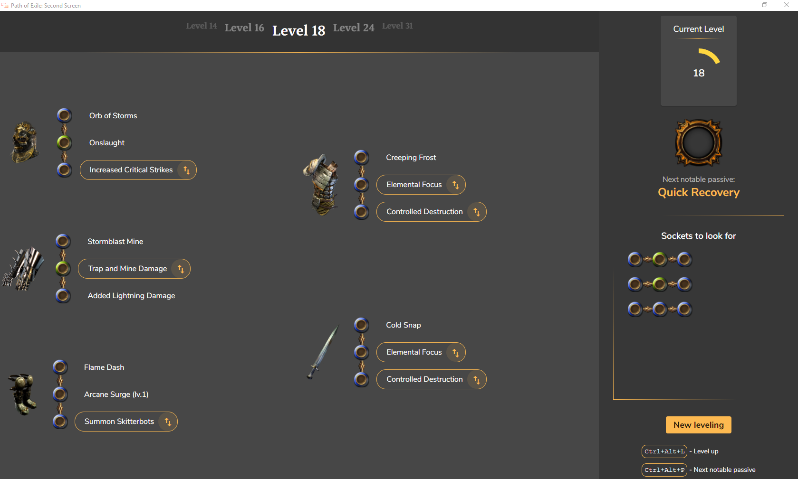

# PoE : Second Screen

This project was generated with [Angular CLI](https://github.com/angular/angular-cli) version 11.2.7.

It uses Electron as a way to make it desktop ready.

# 🔍 Overview



How does it work :

- Click the "New leveling" button
- Enter your character name. It **MUST MATCH** your PoE character name.
- Click "Next"
- Import your file with "Import leveling file" button
- Put the application window on your second screen
- Play _PoE_
- When you reach the next level threshold, the gems and link will change, **highlighting the new additions**. Use it to make the appropriate changes in your character !
- Enjoy your leveling !
- (Optional) Use the _"Socket to look for"_ section if you want to have some notes about which item you should pick

# 📝 Leveling file

Here's how the JSON should be organized:

```typescript
    {
        // This contains the gems and link section
        "gearing": [
            // This next section is repeatable
            // (CAREFUL: you must have a section with level: 1 to start with !)
            {
                // Level requirement for this section
                level: 1,
                // Gear link
                gear: [
                    // Sockets (can be repeated with "helmet", "body_armor",
                    // "gloves", "boots" & "two_handed". All 5 sections must
                    // be completed, even if empty)
                    // This next section is repeatable
                    {
                        // Item holding the links
                        "type": "helmet",
                        // Items links (B = Blue, G = Green, R = Red)
                        // If wrote together, sockets will form a link
                        // (["BB", "GB", "R"] will form a gear piece like that "B-B G-B R")
                        "sockets": ["BG", "B"],
                        // Corresponding gems
                        "gems": ["Frost bomb", "Onslaught", "Orb of Storms"]
                    },
                    // Empty gear example
                    {
                        "type": "body_armor",
                        "sockets": [],
                        "gems": []
                    }
                    ...
                ]
            },
            ...
        ],
        // This contains the notable passives list
        "notables": [
            // This next section is repeatable
            {
                // Number of passive points required to link this notable
                // Careful here: it's INCREMENTAL (see examples)
                passivesRequired: 7,
                // Notable name
                name: "Arcanist's Dominion",
                // Optional: link to the wiki image for display only
                imgLink: "...",
                // Optional: true if the notable is a keystone
                // (like Elemental Overload)
                isKeystone: true,
            }
            ...
        ],
        // This is the section that reflects the links to look for during leveling
        "itemsToLookFor": [
            // This next section is repeatable
            {
                // Minimal level to display the item
                "level": 1,
                // Optional : Max level after which the item shouldn't be displayed.
                // If not set, item will be displayed forever after "level" is reached
                "levelMax": 23,
                // Items links (B = Blue, G = Green, R = Red)
                // If wrote together, sockets will form a link
                // (["BB", "GB", "R"] will form a gear piece like that "B-B G-B R")
                "links": ["BGR"]
            }
            ...
        ]
    }
```

# 💥 Features

## File system

- Import a `.json` file with proper structure to get started (see `exemples/vortex_occultist.json` for guidance)
- The leveling file is saved to a local storage after exiting the application.

## Levels

- Current Level is displayed in the right side
- Level up is automatic !
- Levels are stored after exiting the application

## Passive tree

- Next notable is automatic !
- Next notable is stored after exiting the application

## Gems & Links

- Gems & gear links are displayed in the left side
- New gems appear highlighted
- Links to look for a displayed in the right side (max number of items: 5 / 6 and 5-links max for readability issues)

## Steps

- You can visualize the next gear steps in the level carousel in the top section
- Current step is stored after exiting the application

# 🐛 Issues

Before opening an issue, please verify that your JSON file is configured accordingly (see `exemples/vortex_occultist.json` for guidance)

A JSON file can also be validated for integrity, make sure your file is OK by submitting it here: https://jsonlint.com/

Start by fixing the possible errors here before opening an issue.

Please open an issue if you find any bug in the application usage, along with reproduction steps.

⚠️ **Don't forget to include your .json file, I can't debug and solve the issue other wise**⚠️

# 🤝 Contribution

Submit your PR if you want to add build examples, or for app evolutions.

# ❓ Next steps

Possible improvements :

- ~~Watch the PoE files to automatically level up~~ Done in v1.0.0 !
- Add gem images
- Use a dedicated PoE database
- Added a one handed / two handed option

I might also work on a web tool that will allow you to create your leveling without manually editing a JSON file. It would generate a link, and this link could be pasted into the app (like pastebin url's for PoB)

I'm not sure I will have the time to do that before Ultimatum (3.14) is released, although PRs are welcome!

> Have a nice day, exile ! 👋
